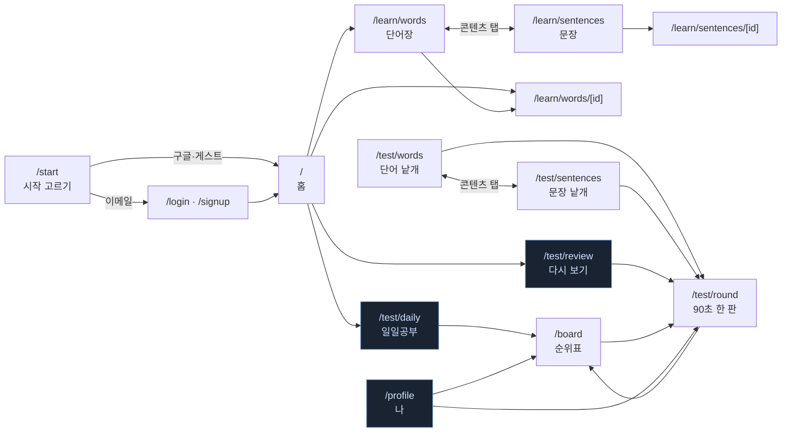
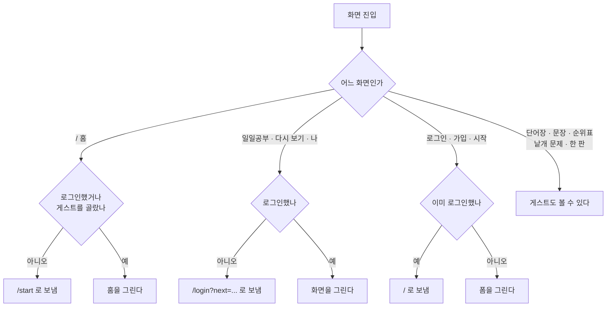
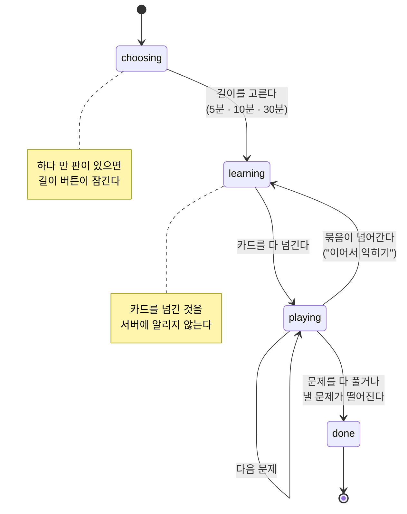
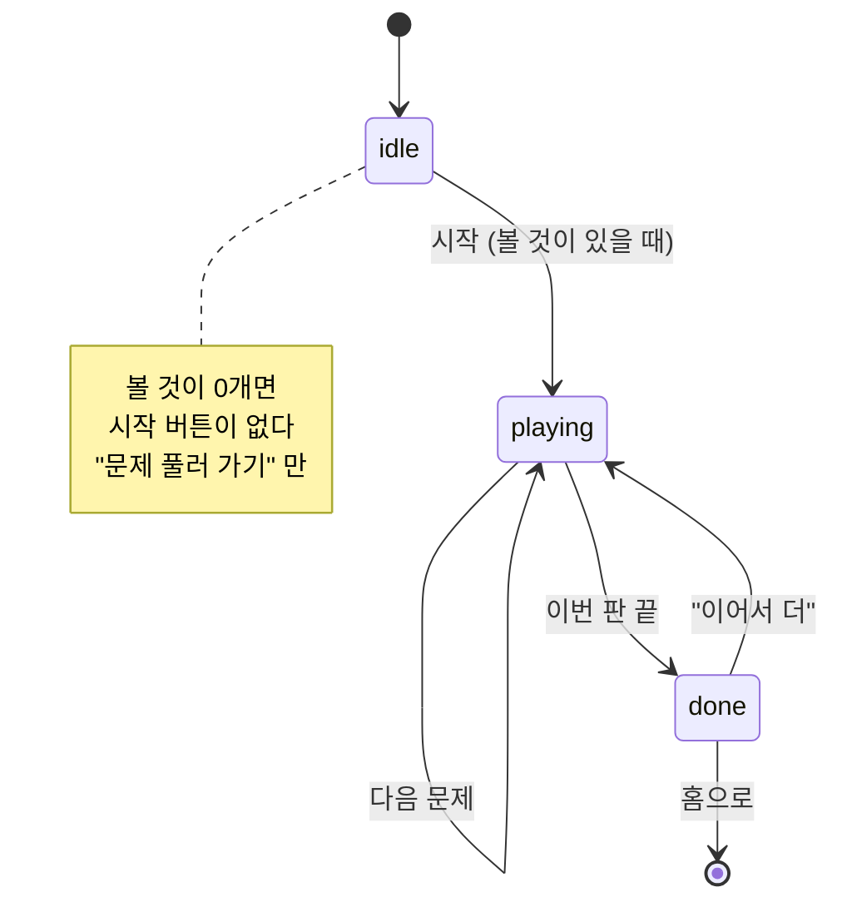
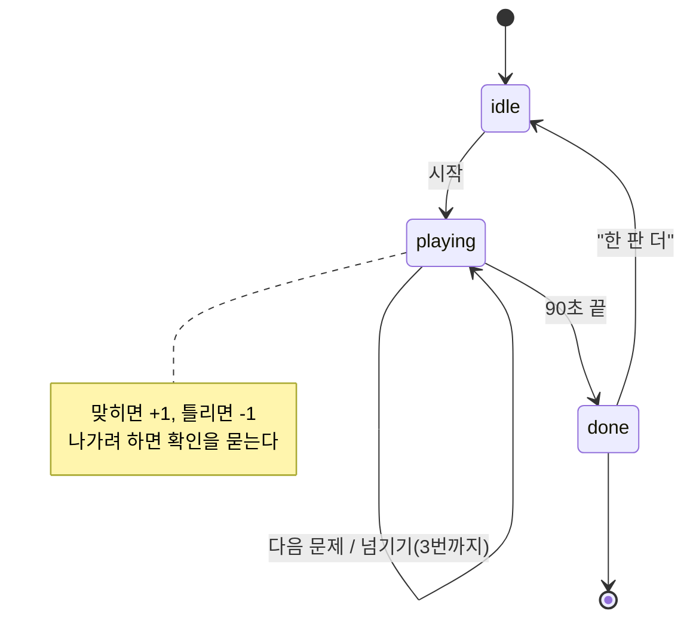

# 화면 흐름과 구조

이 문서는 **지금 코드에 있는 것**을 그린다. 계획이 아니다 - 화면을 고치면
여기도 같이 고친다.

경로 규칙은 `frontend/src/lib/routes.ts` 에 있고, 이 문서는 그 경로들이
실제로 어떻게 이어지는지를 담는다.

## 한눈에



파란 테두리(`일일공부` · `다시 보기` · `나`)는 **로그인이 필요한 화면**이다.
게스트가 들어가면 `/login?next=...` 로 보낸다.

## 아래 탭바

`routes.ts` 의 `tabs` 가 정의한다. 다섯 칸인데 하나는 아직 안 열렸다.

| 탭 | 가는 곳 | 상태 |
|---|---|---|
| 홈 | `/` | |
| 익히기 | `/learn/{보던 콘텐츠}` | |
| 문제풀기 | `/test/{보던 콘텐츠}` | |
| 말하기 | - | **준비 중** (`ready: false`, 눌리지 않음) |
| 나 | `/profile` | |

익히기·문제풀기는 **보던 콘텐츠를 유지한다.** 문장을 보다 "문제풀기" 를
누르면 `/test/sentences` 로 간다 - 단어 문제가 나오면 흐름을 잃는다.

**탭바가 사라지는 화면**이 여섯 개 있다. `/login` · `/signup` · `/start`
(고르기 전에 빠져나갈 수 없게) 와 `/test/words` · `/test/sentences` ·
`/test/round`(문제에 집중). 이 여섯은 대신 화면 안에 나가는 길을 둔다.

## 로그인 게이트



한 판(`/test/round`)은 **게스트도 풀 수 있다.** 점수만 안 남고, 끝난 화면에서
"로그인하면 다음 판부터 순위표에 올라갑니다" 를 띄운다.

## 일일공부 - 학습과 문제를 번갈아

하루 한 번이고 제한 시간이 없다. 카드 몇 장을 익힌 뒤 그 단어들로 문제를
푸는 것을 묶음 단위로 반복한다.



| 길이 | 학습분 | 총 문제 | 완주 보너스 |
|---|---|---|---|
| 5분 | 2개씩 4묶음 (8문제) | 10 | +5 |
| 10분 | 5개씩 4묶음 (20문제) | 25 | +10 |
| 30분 | 5개씩 6묶음 (30문제) | 40 | +25 |

학습분이 전체의 75~80% 이고 나머지는 전체 단어에서 낸다.

**끝나는 화면이 두 갈래다.** 다 풀었으면 "오늘 몫 완료" + 보너스,
낼 문제가 떨어져 일찍 닫혔으면 "오늘은 여기까지" + "낼 수 있는 문제가
떨어져 먼저 마쳤습니다".

## 다시 보기 - 틀린 것과 오래된 것

점수가 없고 시간도 안 잰다. 여기서 **연속으로** 맞혀야 목록에서 빠진다.



홈의 `다시 보기` 카드도 **0개면 아예 안 그린다.** 순위표의 빈 목록,
프로필의 순위 칸도 같은 규칙이다 - **0을 채우지 않는다.**

## 90초 한 판



푸는 중에 나가려 하면 `ExitGuard` 가 확인을 묻는다 - "지금까지 딴 N점이
사라지고 순위표에 오르지 않습니다". **낱개 문제풀이는 안 묻는다**
(점수가 안 남으므로).

## 화면 구조 (wireframe)

세로 순서대로 적었다. 조건이 붙는 것은 괄호로 표시한다.

### `/` 홈

```
[게스트]  오늘의 개발 영어              [로그인]
[로그인]  (아바타) 홍길동 님

  (로그인) ┌─ 일일공부 ─────────── [시작] ─┐
           │ 하루 한 번, 길이를 골라 공부합니다
           └───────────────────────────────┘
  (로그인 · 볼 것>0) ┌─ 다시 보기 ── [12개] ─┐
                     │ 틀린 것과 오래된 것을…
                     └───────────────────────┘

  오늘의 단어
  ┌───────────────────────────────┐
  │ IPv4                          │  ← mono, clamp(2rem, 8.2vw, 2.75rem)
  │ /ˌaɪ piː ˈviː ˌfɔr/           │
  │ 아이 피 v이 f오r               │
  │ 점으로 나눈 네 자리 주소 체계   │
  │ ───────────────────────────── │
  │ [더 보기]  [단어장]            │
  └───────────────────────────────┘

  오늘 이어서 볼 단어
  · 단어 카드 (compact) x N
```

게스트에게는 **일일공부·복습 API 를 아예 호출하지 않는다.** 순위·점수는
홈에 두지 않는다 - "나" 탭이 맡는다.

### `/learn/words` 단어장 (문장도 같은 골격)

```
  [단어] [문장]              ← 콘텐츠 탭
  단어장
  개발할 때 마주치는 영어 단어를 모았습니다.

  [ 검색어…                    ] [검색]

  ▸ 필터 (2)                   ← 접힌 details
      정처기 범위만
      과목  (정처기 범위일 때만)
      난이도
      분류  [전체] [CS 기초] [배포·운영] …

  전체 566개
  ┌─ term / 발음 / reading / 뜻 ─┐  x N
  │ [난이도] [정처기] [분류]      │
  └──────────────────────────────┘

  [이전]  3 페이지  [다음]
```

**빈 상태가 두 갈래다.** 조건이 있으면 "조건에 맞는 단어가 없습니다" +
`조건 지우기` 버튼, 조건이 없으면 "아직 등록된 단어가 없습니다".

### `/test/daily` 일일공부

네 단계가 같은 자리에 번갈아 그려진다.

```
① 길이 고르기            ② 학습 카드
  하루 한 번                먼저 익히기      2/4묶음 · 1/2
  오늘 얼마나 해볼까요       ┌────────────────────────┐
  ┌──────────────────┐      │ salt                   │
  │ 5분  8단어·10문제 +5│      │ /sɒlt/  쏠t            │
  ├──────────────────┤      │ 해시에 섞는 무작위 값    │
  │ 10분 20단어·25문제 │      │ [CS 기초]              │
  ├──────────────────┤      │ ▸ 자세히               │
  │ 30분 30단어·40문제 │      │ ┌ 예문 ──────────────┐│
  └──────────────────┘      │ └───────────────────┘│
                             └────────────────────────┘
                                      [다음]
                             마지막 카드면 [문제 풀기]

③ 문제                    ④ 결과
  2 / 10          2점        오늘 몫 완료
  ▓▓▓░░░░░░░                    9
  ┌──────────────────┐        10문제 중 4개 정답 +5 보너스
  │ 뜻 고르기         │        일일공부는 하루 한 번입니다.
  │ 이 단어의 뜻은?    │
  │ IPv4             │        [순위표에서 확인]
  └──────────────────┘        [홈으로]
  ┌ 보기 4개 ────────┐
  └──────────────────┘
  정답
  (묶음이 넘어가면) [이어서 익히기]
```

문제 화면에서 **다음 묶음이 대기 중이면 보기가 잠긴다.** 자동으로 학습으로
넘기지 않는 이유는 채점 결과가 다음 문제 위에 인라인으로 뜨기 때문이다 -
곧바로 넘기면 맞았는지 틀렸는지를 못 보고 화면이 튄다.

### `/test/round` 90초 한 판

```
① 시작 전                 ② 푸는 중
  ← 홈        순위표        ← 그만두기
                             62초        +3점 · 4/5
      90초                   ▓▓▓▓▓▓░░░░
  한 판 풀어봅니다            ┌──────────────────┐
  맞히면 +1, 틀리면 -1.       │ 빈칸 채우기        │
  모르겠으면 세 번까지        │ …                 │
  넘길 수 있습니다.           └──────────────────┘
                             ┌ 보기 ────────────┐
      [시작]                 └──────────────────┘
                             [넘기기 (2)]    정답

③ 결과
  ← 내 기록
      한 판 끝
        12
  20문제 중 14개 정답 · 2개 넘김 · 1개는 시간이 지나 0점
  [순위표에서 확인]   ← 로그인했을 때
  로그인하면 다음 판부터 순위표에 올라갑니다. [로그인]  ← 게스트
  [한 판 더]
```

### `/profile` 나

```
  내 프로필

  (아바타 72px)
  프로필 사진
  구글 사진을 쓰거나 아래에서 고를 수 있습니다.
  ┌ 사진 고르기 ─────────────┐
  │ ○ ○ ○ ○  (4열 라디오)    │
  └──────────────────────────┘
  보여지는 이름  [            ]  (최대 12자)
  순위표에 이 이름이 뜹니다.
  [저장]
  ──────────────────────────
  학습 기록
  ┌ 내 순위          순위표 전체 ┐
  │ 이번 주   전체   꾸준함      │
  │  120     340     12일       │
  │  3위      7위     2위       │
  └────────────────────────────┘
  ──────────────────────────
  계정
  이메일   mock@devvoca.local
  [로그아웃]
```

## 남은 것

- **말하기 탭** 이 `ready: false` 로 자리만 잡혀 있다.
- **`/test/daily` 와 `/test/review` 에는 `ExitGuard` 가 없다.** 탭바가 있어
  막다르지는 않지만, 다른 문제풀이 화면과 나가는 방식이 다르다.
- 콘텐츠 축에 `errors` · `articles` 가 `routes.ts` 에 예고돼 있으나 화면은
  아직 없다.
